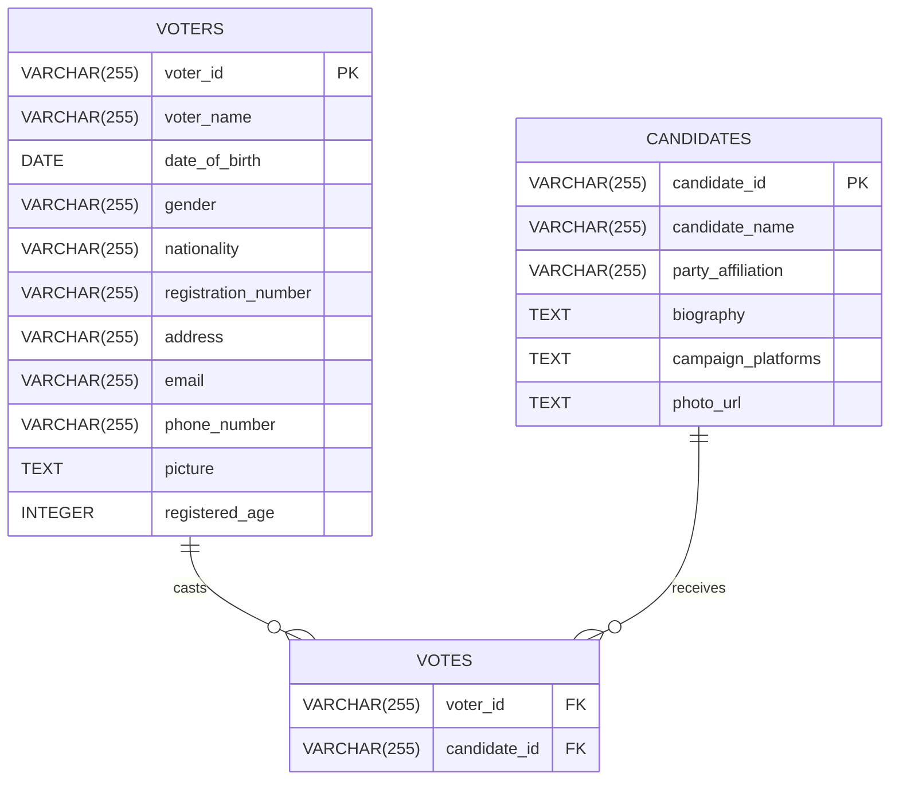

# Realtime Voting System

This project implements a Realtime Voting System using Python, Apache Kafka, Apache Spark, and Streamlit. The system simulates voter data generation, real-time vote processing, aggregation, and visualization.

## Application Architecture

The application follows a microservices architecture with the following components:

- **Producer Service**: Generates dummy voter data and sends it to Kafka.
- **Consumer Service**: Listens to Kafka topics, processes votes, and stores them in PostgreSQL.
- **Stream Processing Service**: Uses Spark Structured Streaming to aggregate and analyze voting data in real-time.
- **Frontend Service**: A Streamlit-based dashboard for visualizing aggregated voting statistics.

## Data Flow

1. **Data Generation**:

   - Voter and candidate data is generated using the Random User API.
   - Initial candidate data is stored in PostgreSQL if not already present.

2. **Data Ingestion**:

   - Voter data is produced to Kafka topics (`voters_topic`).

3. **Real-time Processing**:

   - Kafka Consumers ingest voter data, validate votes, and store them in PostgreSQL (`votes` table).
   - Spark Structured Streaming reads from Kafka topics (`votes_topic`), processes data, aggregates votes per candidate, and turnout by location.
   - Results are produced back to Kafka (`aggregated_votes_per_candidate`, `aggregated_turnout_by_location`).

4. **Visualization**:

   - Streamlit dashboard connects to Kafka topics and PostgreSQL.
   - Displays real-time voting statistics, leading candidates, and voter demographics.

## Components

### `main.py`

Entry point for voter data generation and initial setup.

### `functions/kafka.py`

Utility functions for Kafka message delivery and producer configuration.

### `functions/spark-streaming.py`

Spark Structured Streaming job:

- Reads from Kafka topics (`votes_topic`).
- Processes data, aggregates votes, and computes real-time statistics.
- Writes results back to Kafka (`aggregated_votes_per_candidate`, `aggregated_turnout_by_location`).

### `frontend.py`

Streamlit-based dashboard:

- Fetches and displays real-time voting statistics.
- Uses Matplotlib for dynamic visualizations.
- Allows user interaction for data sorting and pagination.

### `data/voting.py`

Handles Kafka message consumption, vote processing, and insertion into PostgreSQL (`votes` table).

### `data/db_queries.py`

Manages PostgreSQL database schema setup and CRUD operations for candidates, voters, and votes.

## ER Diagram

## Preview

    
    

        
        
    

## Docker Commands

### Kafka Broker

- `kafka-topics --list --bootstrap-server broker:29092`: get list of topics
- `kafka-console-consumer --topic voters_topic --bootstrap-server broker:29092`
- `kafka-console-consumer --topic aggregated_votes_per_candidate --bootstrap-server broker:29092`
- `kafka-topics --delete --topic aggregated_votes_per_candidate --bootstrap-server broker:29092`
- `kafka-topics --delete --topic aggregated_turnout_by_location --bootstrap-server broker:29092`

### Postgres

- `psql -U postgres`: enter postgres
